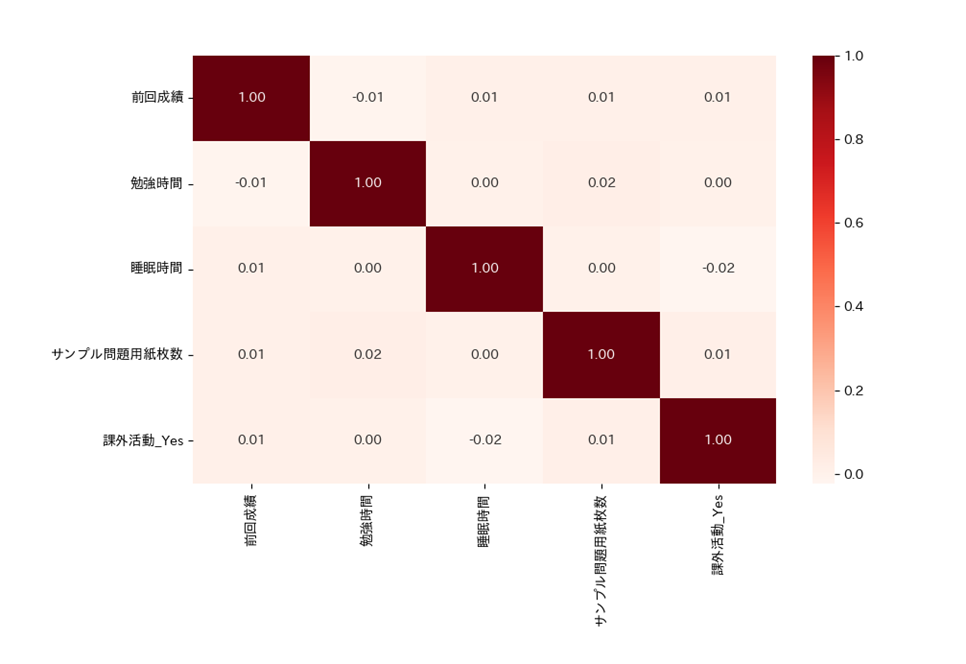
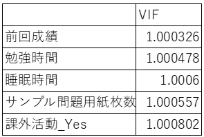
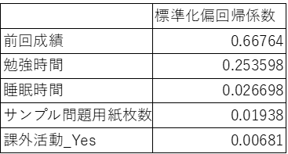

# DataScience

データサイエンスの授業用レポジトリ ソースコードの主な内容は以下の通り

- 重回帰分析を用いた、成績に影響を与える要因の分析
- VIF値による多重共線性の確認
- 相関係数による多重共線性の確認
- ダミー化によるカテゴリ変数の処理

## データセット

[Student Performance (Multiple Linear Regression) / kaggle.com](https://www.kaggle.com/datasets/nikhil7280/student-performance-multiple-linear-regression)

※このデータセットは合成されたものであり、実際のシナリオを反映していない可能性がある

### 説明変数

-	勉強時間 (時間)
-	睡眠時間 (時間)
-	試験のサンプル問題用紙を解いた枚数 (枚)
-   課外活動へ参加しているかどうか (Yes/No)

### 目的変数

-	試験の点数 (10~100)

## 結果

### 相関係数ヒートマップ

説明変数同士に強い相関関係があると、多重共線性が疑われる。多重共線性があると、回帰係数の推定値が不安定になる。課外活動へ参加していると勉強時間が短くなると思っていたけど、そうでもなさそう。

### VIF値

VIF値が10以上の変数がある場合、多重共線性が疑われる。今回は大丈夫。

### 標準化偏回帰係数

値が大きいほど、目的変数に対して影響を与える要因となる。当たり前に前回の成績が高いと、今回の成績も高い。

